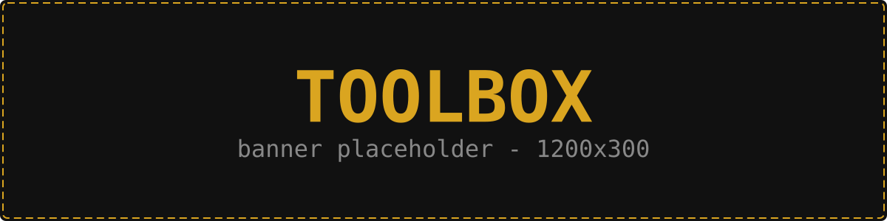
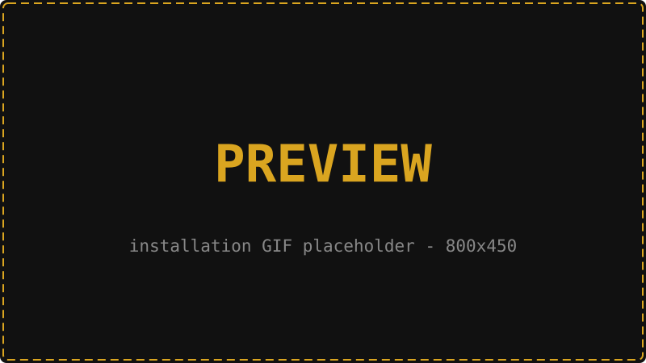
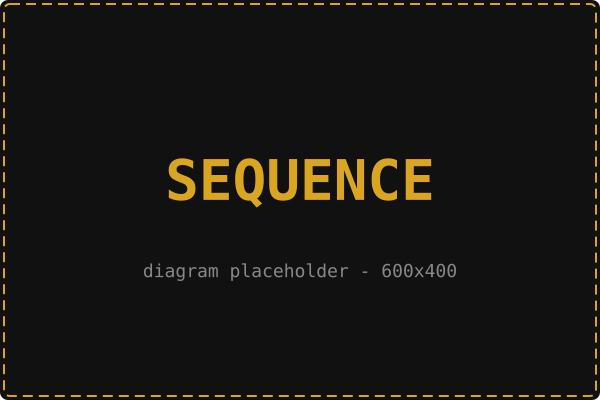

<div align="center">

   <!-- logo -->
   <div style="width: 100%; height: auto; background-color: black;">
      
   </div>
   <br>

   <!-- labels -->
   
   
   

</div>

<!---
 /$$$$$$$$                  /$$ /$$
|__  $$__/                 | $$| $$
   | $$  /$$$$$$   /$$$$$$ | $$| $$$$$$$   /$$$$$$  /$$   /$$
   | $$ /$$__  $$ /$$__  $$| $$| $$__  $$ /$$__  $$|  $$ /$$/
   | $$| $$  \ $$| $$  \ $$| $$| $$  \ $$| $$  \ $$ \  $$$$/
   | $$| $$  | $$| $$  | $$| $$| $$  | $$| $$  | $$  >$$  $$
   | $$|  $$$$$$/|  $$$$$$/| $$| $$$$$$$/|  $$$$$$/ /$$/\  $$
   |__/ \______/  \______/ |__/|_______/  \______/ |__/  \__/

--->
# Toolbox


Toolbox is a fully containerized daily working environment: Neovim, Docker, Kubernetes, Terraform, Azure and AI tooling in one Debian image.
Every input is pinned. The image is rebuilt, tested and published to GHCR automatically, so it keeps working after the day it was set up.

##
<!---
#####################################################
# TL;DR
#####################################################
--->
<h3 id="tldr">
   $\large\color{Goldenrod}{\textbf{TL;DR}}$
</h3>

> [!NOTE]
> Runs as **you** (same UID/GID, same `$HOME`, same `$PWD`) inside a long-running container. Only `/home` (and NFS volumes) persist, so the image stays the single source of truth.

```sh
git clone https://github.com/igor-sadza/toolbox.git && cd toolbox
cp .env.example .env        # optional: pin TOOLBOX_VERSION, ...
make start                  # pull ghcr.io/igor-sadza/toolbox and start
sudo make install           # install the `toolbox` wrapper
toolbox                     # shell inside - as you, in $PWD
```

<!---
$$$$$$$\  $$$$$$$\  $$$$$$$$\ $$\    $$\ $$$$$$\ $$$$$$$$\ $$\      $$\
$$  __$$\ $$  __$$\ $$  _____|$$ |   $$ |\_$$  _|$$  _____|$$ | $\  $$ |
$$ |  $$ |$$ |  $$ |$$ |      $$ |   $$ |  $$ |  $$ |      $$ |$$$\ $$ |
$$$$$$$  |$$$$$$$  |$$$$$\    \$$\  $$  |  $$ |  $$$$$\    $$ $$ $$\$$ |
$$  ____/ $$  __$$< $$  __|    \$$\$$  /   $$ |  $$  __|   $$$$  _$$$$ |
$$ |      $$ |  $$ |$$ |        \$$$  /    $$ |  $$ |      $$$  / \$$$ |
$$ |      $$ |  $$ |$$$$$$$$\    \$  /   $$$$$$\ $$$$$$$$\ $$  /   \$$ |
\__|      \__|  \__|\________|    \_/    \______|\________|\__/     \__|
--->
## Preview
<div align="center">
   <sup><code>It was easy, right?</code></sup>
   <br>
   <br>
   <div style="width: 800; height: auto; background-color: black;">
   
   </div>
</div>

<!---
$$$$$$$$\  $$$$$$\   $$$$$$\
\__$$  __|$$  __$$\ $$  __$$\
   $$ |   $$ /  $$ |$$ /  \__|
   $$ |   $$ |  $$ |$$ |
   $$ |   $$ |  $$ |$$ |
   $$ |   $$ |  $$ |$$ |  $$\
   $$ |    $$$$$$  |\$$$$$$  |
   \__|    \______/  \______/
--->
## Table Of Contents:
- [Usage](#usage)
- [Software](#software)
- [Configuration](#configuration)
- [Miscellaneous](#miscellaneous)

<!---
$$\   $$\  $$$$$$\   $$$$$$\   $$$$$$\  $$$$$$$$\
$$ |  $$ |$$  __$$\ $$  __$$\ $$  __$$\ $$  _____|
$$ |  $$ |$$ /  \__|$$ /  $$ |$$ /  \__|$$ |
$$ |  $$ |\$$$$$$\  $$$$$$$$ |$$ |$$$$\ $$$$$\
$$ |  $$ | \____$$\ $$  __$$ |$$ |\_$$ |$$  __|
$$ |  $$ |$$\   $$ |$$ |  $$ |$$ |  $$ |$$ |
\$$$$$$  |\$$$$$$  |$$ |  $$ |\$$$$$$  |$$$$$$$$\
 \______/  \______/ \__|  \__| \______/ \________|
--->
## Usage
<sup>[(Back to Top)](#table-of-contents)</sup><br>


Day-to-day you only need the `toolbox` wrapper and a handful of `make` targets.

| Command | What it does |
|:--------|:-------------|
| `toolbox` | Interactive shell in the container - as you, in `$PWD` |
| `toolbox <cmd> [args]` | Run a single command, e.g. `toolbox k9s`, `toolbox terraform plan` |
| `toolbox --host` / `make host` | Privileged root shell on the **host** (`chroot /`) |
| `make start` | Pull `ghcr.io/igor-sadza/toolbox:${TOOLBOX_VERSION}` and (re)create the container |
| `make start TOOLBOX_VERSION=1.8.3` | Run / roll back to a specific release |
| `make start-local` | Build the image locally and start it |
| `make stop` | Stop and remove the container |
| `make test [IMAGE=...]` | Smoke test an image |

**Updating** = `make start` (pulls the newest image for your tag and recreates the container).
Image tags: `latest` (last release), `X.Y.Z` / `X.Y` / `X`, `weekly` (last release + Debian security updates), `edge` (develop).

<!---
  /$$$$$$             /$$$$$$   /$$
 /$$__  $$           /$$__  $$ | $$
| $$  \__/  /$$$$$$ | $$  \__//$$$$$$   /$$  /$$  /$$  /$$$$$$   /$$$$$$   /$$$$$$
|  $$$$$$  /$$__  $$| $$$$   |_  $$_/  | $$ | $$ | $$ |____  $$ /$$__  $$ /$$__  $$
 \____  $$| $$  \ $$| $$_/     | $$    | $$ | $$ | $$  /$$$$$$$| $$  \__/| $$$$$$$$
 /$$  \ $$| $$  | $$| $$       | $$ /$$| $$ | $$ | $$ /$$__  $$| $$      | $$_____/
|  $$$$$$/|  $$$$$$/| $$       |  $$$$/|  $$$$$/$$$$/|  $$$$$$$| $$      |  $$$$$$$
 \______/  \______/ |__/        \___/   \_____/\___/  \_______/|__/       \_______/

--->
## Software
<sup>[(Back to Top)](#table-of-contents)</sup><br>


Toolbox is shipped with the tools below (generated from [`.env.example`](./.env.example) by `.cicd/docs/update-readme.sh`).
On top of that: `git`, `tmux`, `go`, `python3` + `pipx`, `clang`, `ripgrep`, `fd`, `sqlite3`, `nfs-common`, `fuse3`, `sshfs`, `rclone`, liquidprompt and ~20 LSP servers / formatters via Mason.

<!-- tools:start -->
| Tool | Method | Version |
|:-----|:------:|:--------|
| [Neovim](https://github.com/neovim/neovim) | `BIN` | `v0.12.4` |
| [Docker Engine](https://docs.docker.com/engine/) | `GPG` | `5:29.6.2-1~debian.13~trixie` |
| [Docker Buildx](https://github.com/docker/buildx) | `GPG` | `0.35.0-1~debian.13~trixie` |
| [Docker Compose](https://github.com/docker/compose) | `GPG` | `5.3.1-1~debian.13~trixie` |
| [K9s](https://github.com/derailed/k9s) | `BIN` | `v0.51.0` |
| [Helm](https://helm.sh) | `GPG` | `4.2.3-1` |
| [Kubectl](https://kubernetes.io/docs/reference/kubectl/) | `GPG` | `1.36.3-1.1` |
| [Terraform](https://www.terraform.io) | `GPG` | `1.15.8-1` |
| [Azure CLI](https://learn.microsoft.com/cli/azure/) | `GPG` | `2.88.0-1~bookworm` |
| [Node.js](https://nodejs.org) | `GPG` | `22.23.1-1nodesource1` |
| [Gomplate](https://github.com/hairyhenderson/gomplate) | `BIN` | `v5.2.0` |
| [Act](https://github.com/nektos/act) | `BIN` | `v0.2.89` |
| [Rust](https://www.rust-lang.org) | `RUSTUP` | `1.98.1` |
| [tree-sitter CLI](https://github.com/tree-sitter/tree-sitter) | `CARGO` | `0.26.11` |
| [OpenCode](https://opencode.ai) | `NPM` | `1.18.13` |
| [Codex CLI](https://github.com/openai/codex) | `NPM` | `0.153.4` |
| [uv](https://github.com/astral-sh/uv) | `PIPX` | `0.12.1` |
| Base image | `DOCKER` | `debian:trixie-slim` |
<!-- tools:end -->

<!---
 $$$$$$\   $$$$$$\  $$\   $$\ $$$$$$$$\ $$$$$$\  $$$$$$\  $$\   $$\ $$$$$$$\   $$$$$$\ $$$$$$$$\ $$$$$$\  $$$$$$\  $$\   $$\
$$  __$$\ $$  __$$\ $$$\  $$ |$$  _____|\_$$  _|$$  __$$\ $$ |  $$ |$$  __$$\ $$  __$$\\__$$  __|\_$$  _|$$  __$$\ $$$\  $$ |
$$ /  \__|$$ /  $$ |$$$$\ $$ |$$ |        $$ |  $$ /  \__|$$ |  $$ |$$ |  $$ |$$ /  $$ |  $$ |     $$ |  $$ /  $$ |$$$$\ $$ |
$$ |      $$ |  $$ |$$ $$\$$ |$$$$$\      $$ |  $$ |$$$$\ $$ |  $$ |$$$$$$$  |$$$$$$$$ |  $$ |     $$ |  $$ |  $$ |$$ $$\$$ |
$$ |      $$ |  $$ |$$ \$$$$ |$$  __|     $$ |  $$ |\_$$ |$$ |  $$ |$$  __$$< $$  __$$ |  $$ |     $$ |  $$ |  $$ |$$ \$$$$ |
$$ |  $$\ $$ |  $$ |$$ |\$$$ |$$ |        $$ |  $$ |  $$ |$$ |  $$ |$$ |  $$ |$$ |  $$ |  $$ |     $$ |  $$ |  $$ |$$ |\$$$ |
\$$$$$$  | $$$$$$  |$$ | \$$ |$$ |      $$$$$$\ \$$$$$$  |\$$$$$$  |$$ |  $$ |$$ |  $$ |  $$ |   $$$$$$\  $$$$$$  |$$ | \$$ |
 \______/  \______/ \__|  \__|\__|      \______| \______/  \______/ \__|  \__|\__|  \__|  \__|   \______| \______/ \__|  \__|
--->

## Configuration
<sup>[(Back to Top)](#table-of-contents)</sup><br>


All settings live in one file: [`.env.example`](./.env.example) (copy to `.env` for local overrides - `.env` is git-ignored).
The documents below describe how the environment is configured, what survives an update and how the automation keeps it alive.

### Table Of Contents:
  - $\large\color{Goldenrod}{\textbf{Configuration}}$
     - [Configuration - `Runtime`](./docs/configuration.md#configuration---runtime)
     - [Configuration - `Storage (NFS / FUSE)`](./docs/configuration.md#configuration---storage)
     - [Configuration - `Host access`](./docs/configuration.md#configuration---host-access)
  - $\large\color{Goldenrod}{\textbf{Persistence}}$
     - [Persistence - `What survives an update`](./docs/persistence.md#persistence---what-survives)
     - [Persistence - `Personal additions`](./docs/persistence.md#persistence---personal-additions)
  - $\large\color{Goldenrod}{\textbf{Updates}}$
     - [Updates - `Pipeline`](./docs/updates.md#updates---pipeline)
     - [Updates - `Adding a tool`](./docs/updates.md#updates---adding-a-tool)
     - [Updates - `Rollback & failures`](./docs/updates.md#updates---rollback--failures)
  - $\large\color{Goldenrod}{\textbf{Development}}$
     - [Development - `Local build & test`](./docs/development.md#development---local-build--test)
     - [Development - `Releases`](./docs/development.md#development---releases)
     - [Development - `GitHub setup`](./docs/development.md#development---github-setup)

<!---
$$$$$$$\  $$$$$$$\  $$$$$$$$\ $$\    $$\ $$$$$$\ $$$$$$$$\ $$\      $$\
$$  __$$\ $$  __$$\ $$  _____|$$ |   $$ |\_$$  _|$$  _____|$$ | $\  $$ |
$$ |  $$ |$$ |  $$ |$$ |      $$ |   $$ |  $$ |  $$ |      $$ |$$$\ $$ |
$$$$$$$  |$$$$$$$  |$$$$$\    \$$\  $$  |  $$ |  $$$$$\    $$ $$ $$\$$ |
$$  ____/ $$  __$$< $$  __|    \$$\$$  /   $$ |  $$  __|   $$$$  _$$$$ |
$$ |      $$ |  $$ |$$ |        \$$$  /    $$ |  $$ |      $$$  / \$$$ |
$$ |      $$ |  $$ |$$$$$$$$\    \$  /   $$$$$$\ $$$$$$$$\ $$  /   \$$ |
\__|      \__|  \__|\________|    \_/    \______|\________|\__/     \__|
--->
<h2>Preview</h2>
<div align="center">
   <sup><code>Sequences! We love sequences, right?</code></sup>
   <br>
   <br>
   <div style="width: 600; height: auto; background-color: black;">
      
   </div>
</div>

<!---
$$\      $$\ $$$$$$\  $$$$$$\   $$$$$$\
$$$\    $$$ |\_$$  _|$$  __$$\ $$  __$$\
$$$$\  $$$$ |  $$ |  $$ /  \__|$$ /  \__|
$$\$$\$$ $$ |  $$ |  \$$$$$$\  $$ |
$$ \$$$  $$ |  $$ |   \____$$\ $$ |
$$ |\$  /$$ |  $$ |  $$\   $$ |$$ |  $$\
$$ | \_/ $$ |$$$$$$\ \$$$$$$  |\$$$$$$  |
\__|     \__|\______| \______/  \______/
--->
## Miscellaneous
<sup>[(Back to top)](#table-of-contents)</sup>


The "Miscellaneous" section gathers various resources and content that may not belong to a specific category but are still valuable and worth referencing.

### Table Of Contents:
- $\large\color{Goldenrod}{\textbf{Helpful Resources}}$
   - [TODO List (Roadmap)](./docs/roadmap.md#roadmap---todo-list)
   - [Changelog](./CHANGELOG.md)

<br>
<br>
<div align="center">
   
</div>
